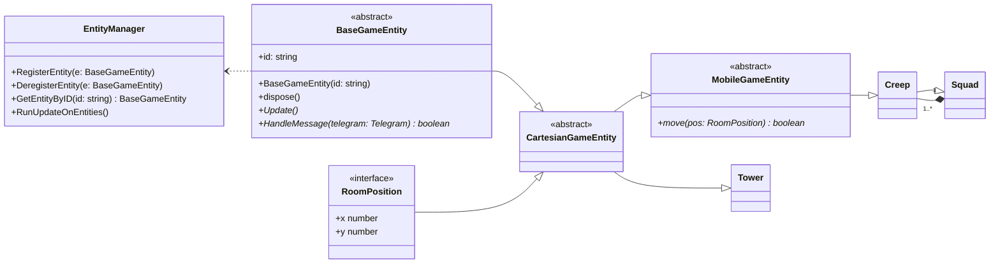

## /src/common/Game

contains all basic classes for Game Entities.

the EntityManager is a Sigelton class to find Entities by ID for e.g. messaging

```mermaid
classDiagram
direction RL
class EntityManager {
  +RegisterEntity(e: BaseGameEntity)
  +DeregisterEntity(e: BaseGameEntity)
  +GetEntityByID(id: string) BaseGameEntity
  +RunUpdateOnEntities()
}

class BaseGameEntity{
    <<abstract>>
    +id: string
    +BaseGameEntity(id: string)
    +dispose()
    +Update()*
    +HandleMessage(telegram: Telegram)* boolean
}

class CartesianGameEntity {
  <<abstract>>
}

class MobileGameEntity {
  <<abstract>>
  +move(pos: RoomPosition)* boolean
}

class RoomPosition {
  <<interface>>
  +x number
  +y number
}
BaseGameEntity ..> EntityManager
CartesianGameEntity <|-- RoomPosition
CartesianGameEntity <|-- BaseGameEntity
MobileGameEntity <|-- CartesianGameEntity
Tower <|-- CartesianGameEntity
Creep <|-- MobileGameEntity
Squad <|-- Creep
Squad "1" *--  "1..*" Creep

```
